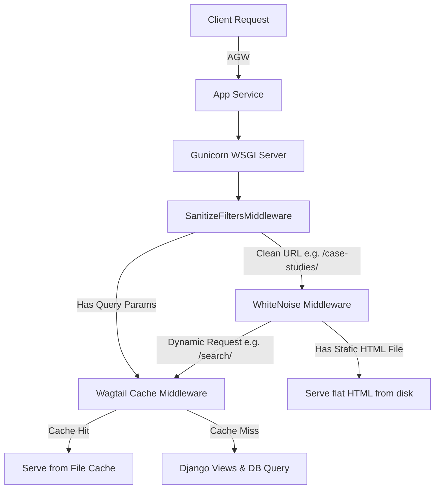

# Hybrid Static Baking & Caching Design Spec

## 1. Objective
Protect the NHS Innovation Service Informational Web App from botnet/DDoS attacks, cache-busting attempts, and single-thread blocking without touching the WAF.

---

## 2. Architecture Overview
This design implements a hybrid architecture:
1. **Concurrency**: Gunicorn replaces Django `runserver` to handle concurrent traffic.
2. **Static Asset Caching**: WhiteNoise serves static files (CSS, JS, images) with optimal cache headers.
3. **Flat HTML Serving (Clean URLs)**: `wagtail-bakery` pre-renders pages (like `/case-studies/` or `/news/`) to disk. WhiteNoise serves these instantly.
4. **Query Parameter Handling**: Any request containing query parameters (like `/case-studies/?types=Digital`) automatically bypasses WhiteNoise and falls through to Gunicorn. Django serves these dynamically, protected by the existing `SanitizeFiltersMiddleware` (which cleans cache-busters) and cached by `wagtail-cache`.
5. **Local Automation**: Rebuilds of clean URLs are triggered automatically **on application startup** and **whenever Wagtail content is published/unpublished** in a background thread inside Python.



---

## 3. Detailed Specifications

### 3.1 WSGI Concurrency & Startup (Gunicorn)
Currently, [startup.sh](file:///home/redabelca/NHS/innovation-service-informational-frontend/.scripts/startup.sh#L18-L19) runs `python3 manage.py runserver`, limiting processing to a single thread.
* **Change**: Update the startup script to trigger a flat-page build on startup, followed by starting Gunicorn:
  ```bash
  # Pre-bake static pages on application startup
  python3 manage.py build
  
  # Start production WSGI server
  gunicorn --bind=0.0.0.0:8000 --workers 3 --timeout 600 is_homepage.wsgi
  ```

### 3.2 Static Asset Delivery (WhiteNoise)
* **Change**: Add `whitenoise==6.7.0` to `requirements.txt`.
* **Change**: Add `whitenoise.middleware.WhiteNoiseMiddleware` immediately after `django.middleware.security.SecurityMiddleware` in [base.py](file:///home/redabelca/NHS/innovation-service-informational-frontend/is_homepage/settings/base.py#L76).
* **Change**: Update `STATICFILES_STORAGE` in [base.py](file:///home/redabelca/NHS/innovation-service-informational-frontend/is_homepage/settings/base.py#L201):
  ```python
  STATICFILES_STORAGE = "whitenoise.storage.CompressedManifestStaticFilesStorage"
  ```

### 3.3 Flat Page Serving (`wagtail-bakery`)
* **Change**: Add `wagtail-bakery` to `requirements.txt` and `INSTALLED_APPS` in [base.py](file:///home/redabelca/NHS/innovation-service-informational-frontend/is_homepage/settings/base.py#L27).
* **Change**: Add settings to [base.py](file:///home/redabelca/NHS/innovation-service-informational-frontend/is_homepage/settings/base.py):
  ```python
  BUILD_DIR = os.path.join(BASE_DIR, "build")
  BAKERY_VIEWS = (
      "wagtailbakery.views.AllPagesView",
  )
  # Configure WhiteNoise to serve baked pages from the build directory
  WHITENOISE_ROOT = BUILD_DIR
  WHITENOISE_INDEX_FILE = True
  ```

### 3.4 Automated Rebuilds
We will use Wagtail's page signals to trigger a local rebuild asynchronously in a Python background thread when pages are modified.
* **Change**: Create a signal receiver in `is_homepage/apps/base/wagtail_hooks.py` (or a dedicated signals file):
  ```python
  from django.core.management import call_command
  from wagtail.signals import page_published, page_unpublished
  import threading

  def trigger_async_rebuild(sender, **kwargs):
      def run_rebuild():
          try:
              call_command("build")
          except Exception as e:
              # Log error gracefully
              pass
              
      threading.Thread(target=run_rebuild).start()

  page_published.connect(trigger_async_rebuild)
  page_unpublished.connect(trigger_async_rebuild)
  ```

---

## 5. Verification and Testing Plan
1. **Startup Build Verification**: Check that files are baked in `build/` immediately when container starts up.
2. **Page Caching**: Verify that filtered requests (with valid types/tags) correctly hit Gunicorn and are cached by `wagtail-cache`.
3. **Load Testing**: Validate that concurrent requests to static or cached files handle high concurrency on Gunicorn.
