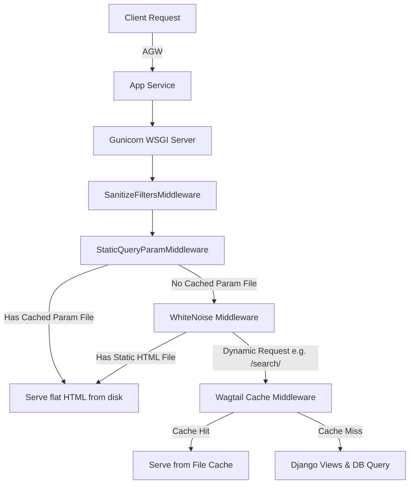

# Hybrid Static Baking & Caching Design Spec

## 1. Objective
Protect the NHS Innovation Service Informational Web App from botnet/DDoS attacks, cache-busting attempts, and single-thread blocking without touching the WAF.

---

## 2. Architecture Overview
This design implements a hybrid architecture:
1. **Concurrency**: Gunicorn replaces Django `runserver` to handle concurrent traffic.
2. **Static Asset Caching**: WhiteNoise serves static files with optimal cache headers.
3. **Flat HTML Serving (Clean URLs)**: `wagtail-bakery` pre-renders pages (like `/case-studies/` or `/news/`) to disk. WhiteNoise serves these instantly.
4. **Query Parameter Serving**: A custom Django command bakes valid filter combinations to disk (e.g. `/case-studies/?types=Digital`), and a custom middleware serves them directly from disk.
5. **Dynamic Fallback**: Any dynamic endpoints (like `/search/` or rare filter combos) fall through to Gunicorn and are cached by the existing `wagtail-cache` + `SanitizeFiltersMiddleware`.
6. **Local Automation**: Rebuilds are triggered automatically in a background thread inside Python whenever Wagtail content is published/unpublished.



---

## 3. Detailed Specifications

### 3.1 WSGI Concurrency (Gunicorn)
Currently, [startup.sh](file:///home/redabelca/NHS/innovation-service-informational-frontend/.scripts/startup.sh#L18-L19) runs `python3 manage.py runserver`, limiting processing to a single thread.
* **Change**: Change the start command to:
  ```bash
  gunicorn --bind=0.0.0.0:8000 --workers 3 --timeout 600 is_homepage.wsgi
  ```

### 3.2 Static Asset Delivery (WhiteNoise)
* **Change**: Add `whitenoise==6.7.0` to `requirements.txt`.
* **Change**: Add `whitenoise.middleware.WhiteNoiseMiddleware` immediately after `django.middleware.security.SecurityMiddleware` in [base.py](file:///home/redabelca/NHS/innovation-service-informational-frontend/is_homepage/settings/base.py#L76).
* **Change**: Update `STATICFILES_STORAGE` in [base.py](file:///home/redabelca/NHS/innovation-service-informational-frontend/is_homepage/settings/base.py#L201):
  ```python
  STATICFILES_STORAGE = "whitenoise.storage.CompressedManifestStaticFilesStorage"
  ```

### 3.3 Flat Page Serving (`wagtail-bakery`)
* **Change**: Add `wagtail-bakery` to `requirements.txt` and `INSTALLED_APPS` in [base.py](file:///home/redabelca/NHS/innovation-service-informational-frontend/is_homepage/settings/base.py#L27).
* **Change**: Add settings to [base.py](file:///home/redabelca/NHS/innovation-service-informational-frontend/is_homepage/settings/base.py):
  ```python
  BUILD_DIR = os.path.join(BASE_DIR, "build")
  BAKERY_VIEWS = (
      "wagtailbakery.views.AllPagesView",
  )
  # Configure WhiteNoise to serve baked pages from the build directory
  WHITENOISE_ROOT = BUILD_DIR
  WHITENOISE_INDEX_FILE = True
  ```

### 3.4 Query Parameter Baking
1. **Management Command**: Write `is_homepage/apps/case_studies/management/commands/bake_filters.py`.
   * Loops through all valid combinations of `types` and `tags` (using snippets/database objects).
   * Uses Django's `RequestFactory` or test client to internally render `/case-studies/?types=...&tags=...`
   * Creates a deterministic filename hash (e.g. `case-studies/cache/types_Digital_tags_Innovation.html`).
   * Saves the rendered HTML to that file path in the `BUILD_DIR`.
2. **Middleware**: Write `is_homepage/middleware/static_query_param.py`.
   * Intercepts `GET` requests to `/case-studies/` and `/news/`.
   * Constructs the target cache filename based on the sorted query parameters.
   * If the file exists, returns a `FileResponse` directly (bypassing view/db processing).
   * Register this middleware right after `SanitizeFiltersMiddleware` in [base.py](file:///home/redabelca/NHS/innovation-service-informational-frontend/is_homepage/settings/base.py#L76).

### 3.5 Automated Rebuilds
We will use Wagtail's page signals to trigger a local rebuild asynchronously in a Python background thread when pages are modified.
* **Change**: Create a signal receiver in `is_homepage/apps/base/wagtail_hooks.py` (or a dedicated signals file):
  ```python
  from django.core.management import call_command
  from wagtail.signals import page_published, page_unpublished
  import threading

  def trigger_async_rebuild(sender, **kwargs):
      def run_rebuild():
          try:
              call_command("build")
              call_command("bake_filters")
          except Exception as e:
              # Log error gracefully
              pass
              
      threading.Thread(target=run_rebuild).start()

  page_published.connect(trigger_async_rebuild)
  page_unpublished.connect(trigger_async_rebuild)
  ```

---

## 4. Verification and Testing Plan
1. **Local Run**: Execute `python manage.py build` and `python manage.py bake_filters` locally, verifying the files appear in the `build/` folder.
2. **Offline Mode**: Verify that query parameter pages load correctly even if database connection is temporarily simulated as down (ensures disk serving works).
3. **Load Testing**: Validate that concurrent requests to static or cached files handle high concurrency on Gunicorn.
